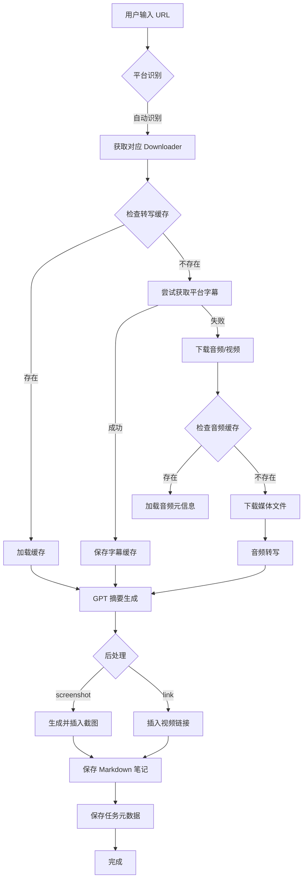

我将为您编写一份详细的BiliNote项目架构报告。首先让我深入了解项目的各个模块和组件。
现在我已经收集了足够的信息，让我为您编写一份详细的BiliNote项目架构报告。

---

# BiliNote CLI 项目架构报告

## 1. 项目概述

**BiliNote CLI** 是一个命令行 AI 视频笔记生成工具，旨在帮助用户自动从视频内容中提取关键信息并生成结构化的 Markdown 格式笔记。项目支持多平台视频源（Bilibili、YouTube、抖音、快手等）以及本地视频文件，通过音频转写和 AI 大模型技术，实现视频内容的智能摘要和知识整理。

### 核心功能
- 多平台视频下载与处理
- 音频转文字（支持多种转写引擎）
- AI 智能摘要与笔记生成
- 视频截图插入与时间戳链接
- 多模态视频理解（AI 同时分析音频和画面）

---

## 2. 整体架构

### 2.1 架构分层

```
┌─────────────────────────────────────────────────────────────┐
│                      CLI 交互层 (cli.py)                      │
│              命令解析、参数处理、用户交互                        │
└─────────────────────────────────────────────────────────────┘
                              │
                              ▼
┌─────────────────────────────────────────────────────────────┐
│                   业务服务层 (services/)                       │
│    NoteGenerator │ Searcher │ SerialExecutor │ ConfigManager │
└─────────────────────────────────────────────────────────────┘
                              │
                              ▼
┌─────────────────────────────────────────────────────────────┐
│                    核心处理层                                 │
│  ┌──────────────┐  ┌──────────────┐  ┌──────────────────┐  │
│  │  Downloaders │  │ Transcribers │  │      GPT         │  │
│  │   下载器模块   │  │   转写模块    │  │   AI处理模块      │  │
│  └──────────────┘  └──────────────┘  └──────────────────┘  │
└─────────────────────────────────────────────────────────────┘
                              │
                              ▼
┌─────────────────────────────────────────────────────────────┐
│                   基础设施层                                  │
│    Utils │ Models │ Exceptions │ Enums │ Validators         │
└─────────────────────────────────────────────────────────────┘
                              │
                              ▼
┌─────────────────────────────────────────────────────────────┐
│                    数据存储层 (data/)                          │
│  downloads │ cache │ output │ state │ temp │ resources      │
└─────────────────────────────────────────────────────────────┘
```

### 2.2 模块划分

| 模块 | 路径 | 职责 |
|------|------|------|
| CLI 入口 | `src/cli.py` | 命令行接口，参数解析，用户交互 |
| 下载器 | `src/app/downloaders/` | 多平台视频/音频下载 |
| 转写器 | `src/app/transcriber/` | 音频转文字 |
| GPT服务 | `src/app/gpt/` | AI 摘要生成 |
| 业务服务 | `src/app/services/` | 核心业务逻辑编排 |
| 数据模型 | `src/app/models/` | Pydantic 数据模型定义 |
| 工具函数 | `src/app/utils/` | 通用工具函数 |
| 配置管理 | `src/config/` | 模型配置、转写配置 |

---

## 3. 核心模块分析

### 3.1 下载器模块 (Downloaders)

**架构设计**：基于抽象基类 `Downloader` 实现多平台支持

```python
# 抽象基类定义
class Downloader(ABC):
    @abstractmethod
    def download(self, video_url, output_dir, quality, ...) -> AudioDownloadResult
    def download_subtitles(self, video_url, ...) -> Optional[TranscriptResult]
```

**支持的平台**：

| 平台 | 实现类 | 文件 | 特点 |
|------|--------|------|------|
| Bilibili | `BilibiliDownloader` | `bilibili_downloader.py` | 支持 Cookie 登录、字幕获取 |
| YouTube | `YoutubeDownloader` | `youtube_downloader.py` | 支持字幕下载、视频下载 |
| 抖音 | `DouyinDownloader` | `douyin_downloader.py` | 含辅助模块 `douyin_helper/` |
| 快手 | `KuaishouDownloader` | `kuaishou_downloader.py` | 含辅助模块 `kuaishou_helper/` |
| 本地文件 | `LocalDownloader` | `local_downloader.py` | 处理本地视频文件 |
| 小宇宙FM | - | `xiaoyuzhoufm_download.py` | 播客音频下载 |

**平台映射** (`services/constant.py`)：
```python
SUPPORT_PLATFORM_MAP = {
    "bilibili": BilibiliDownloader(),
    "youtube": YoutubeDownloader(),
    "douyin": DouyinDownloader(),
    "kuaishou": KuaishouDownloader(),
    "local": LocalDownloader(),
}
```

### 3.2 转录模块 (Transcriber)

**设计模式**：工厂模式 + 单例模式

**支持的转写引擎**：

| 引擎 | 标识符 | 特点 | 适用场景 |
|------|--------|------|----------|
| faster-whisper | `fast-whisper` | 本地 GPU 加速 | 有 NVIDIA GPU |
| MLX Whisper | `mlx-whisper` | Apple Silicon 专用 | macOS Apple Silicon |
| Apple Speech | `apple-speech` | macOS 系统内置 | macOS 免费转写 |
| Groq | `groq` | 在线 API | 无需本地 GPU |
| B站必剪 | `bcut` | B站在线转写 | B站视频 |
| 快手 | `kuaishou` | 快手在线转写 | 快手视频 |

**配置示例** (`config/transcriber.json`)：
```json
{
  "default_transcriber": "mlx-whisper",
  "transcribers": {
    "fast-whisper": {
      "enabled": true,
      "model_size": "base",
      "device": "cuda"
    },
    "mlx-whisper": {
      "enabled": true,
      "model_size": "base"
    }
  }
}
```

### 3.3 GPT服务模块 (GPT)

**架构设计**：
- **基类**：`GPT` (`base.py`) - 定义统一接口
- **工厂**：`GPTFactory` (`gpt_factory.py`) - 创建 GPT 实例
- **实现**：`UniversalGPT` (`universal_gpt.py`) - 通用 OpenAI 兼容实现

**支持的 AI 供应商**（14+ 模型）：

| 供应商 | 模型示例 | 环境变量 |
|--------|----------|----------|
| OpenAI | gpt-4o, gpt-4, gpt-3.5-turbo | `OPENAI_API_KEY` |
| DeepSeek | deepseek-chat, deepseek-coder | `DEEPSEEK_API_KEY` |
| 通义千问 | qwen-turbo, qwen-plus, qwen-max | `QWEN_API_KEY` |
| Claude | claude-3-opus, claude-3-sonnet | `CLAUDE_API_KEY` |
| Gemini | gemini-pro | `GEMINI_API_KEY` |
| Groq | llama-3-70b | `GROQ_API_KEY` |
| Ollama | llama3 (本地) | `OLLAMA_API_KEY` |

**核心功能**：
- 智能分块处理长文本（`request_chunker.py`）
- 断点续传机制（检查点保存/恢复）
- 多模态输入（文本 + 视频帧图像）
- 自动重试与错误处理

### 3.4 核心业务逻辑 (Services)

#### NoteGenerator (`services/note.py`)

**职责**： orchestrate 整个笔记生成流程

**处理流程**：
```
1. 解析阶段 (PARSING)
   ├── 获取下载器实例
   └── 获取 GPT 实例
   
2. 字幕获取阶段
   ├── 检查转写缓存
   ├── 尝试获取平台字幕（优先）
   └── 无字幕则下载音频
   
3. 下载阶段 (DOWNLOADING)
   ├── 检查音频缓存
   ├── 下载视频（如需截图/视频理解）
   └── 下载音频文件
   
4. 转写阶段 (TRANSCRIBING)
   └── 音频转文字（如无平台字幕）
   
5. 摘要阶段 (SUMMARIZING)
   └── GPT 生成 Markdown 笔记
   
6. 后处理阶段
   ├── 插入截图（如启用）
   ├── 插入链接（如启用）
   └── 添加源链接
   
7. 保存阶段 (SAVING)
   └── 保存元数据到 JSON
```

#### 其他服务
- **Searcher** (`searcher.py`)：视频搜索功能
- **SerialExecutor** (`serial_executor.py`)：串行批量任务执行
- **TranscriberConfigManager** (`transcriber_config_manager.py`)：转写配置管理

---

## 4. 数据流处理

### 4.1 完整数据流图



### 4.2 缓存策略

| 缓存类型 | 文件路径 | 用途 |
|----------|----------|------|
| 转写缓存 | `data/cache/transcript/{task_id}_transcript.json` | 字幕/转写结果 |
| 音频元信息 | `data/cache/audio_meta/{task_id}_audio.json` | 视频标题、时长等信息 |
| Markdown 缓存 | `data/output/notes/{task_id}.md` | 生成的笔记 |
| GPT 检查点 | `data/cache/{task_id}.gpt.checkpoint.json` | 长文本处理断点续传 |
| 任务状态 | `data/state/{task_id}.status.json` | 任务执行状态 |

---

## 5. 配置管理

### 5.1 模型配置 (`config/models.json`)

```json
{
  "default_model": "deepseek-chat",
  "models": {
    "gpt-4o": {
      "api_key_env": "OPENAI_API_KEY",
      "base_url": "https://api.openai.com/v1",
      "model_name": "gpt-4o"
    },
    "deepseek-chat": {
      "api_key_env": "DEEPSEEK_API_KEY",
      "base_url": "https://api.deepseek.com",
      "model_name": "deepseek-chat"
    }
  }
}
```

**管理接口**：
- `list_available_models()` - 列出所有模型
- `get_model_config(model_id)` - 获取模型配置
- `set_default_model(model_id)` - 设置默认模型
- `add_model(...)` / `remove_model(...)` - 增删模型

### 5.2 转写配置 (`config/transcriber.json`)

支持通过环境变量覆盖配置：
- `TRANSCRIBER_TYPE` - 转写引擎类型
- `WHISPER_MODEL_SIZE` - Whisper 模型大小
- `APPLE_SPEECH_LANGUAGE` - Apple Speech 语言

### 5.3 环境变量 (`.env`)

```bash
# AI 模型 API Keys
DEEPSEEK_API_KEY=sk-xxx
OPENAI_API_KEY=sk-xxx
QWEN_API_KEY=sk-xxx

# 平台 Cookies
BILIBILI_COOKIE=SESSDATA=xxx
DOUYIN_COOKIE=ttwid=xxx
KUAISHOU_COOKIE=did=xxx

# 转写配置
TRANSCRIBER_TYPE=mlx-whisper
WHISPER_MODEL_SIZE=base
```

---

## 6. 文件系统组织

### 6.1 目录结构

```
BiliNote-cli/
├── data/                          # 数据目录（与 src 平级）
│   ├── downloads/                 # 原始音视频下载
│   │   └── {task_id}.mp3
│   ├── cache/                     # 中间缓存（持久化）
│   │   ├── transcript/            # 转写结果缓存
│   │   │   └── {task_id}_transcript.json
│   │   ├── audio_meta/            # 音频元信息缓存
│   │   │   └── {task_id}_audio.json
│   │   └── {task_id}_metadata.json
│   ├── output/                    # 最终输出
│   │   └── notes/                 # Markdown 笔记
│   │       └── {task_id}.md
│   ├── temp/                      # 临时文件
│   │   └── {task_id}_screenshots/ # 截图临时存储
│   ├── state/                     # 任务状态
│   │   └── {task_id}.status.json
│   ├── resources/                 # 资源文件
│   │   └── arial.ttf             # 字体文件
│   └── models/                    # 本地模型
│       └── whisper/
├── src/                           # 源代码
│   ├── app/                       # 应用代码
│   └── config/                    # 配置文件
└── logs/                          # 日志文件
    └── app.log
```

### 6.2 PathManager 工具类

统一路径管理，提供以下方法：
- `get_download_path(task_id)` - 下载文件路径
- `get_transcript_cache_path(task_id)` - 转写缓存路径
- `get_note_output_path(task_id)` - 笔记输出路径
- `get_state_file_path(task_id)` - 状态文件路径
- `get_temp_dir(task_id, subdir)` - 临时目录

---

## 7. 项目依赖和打包

### 7.1 依赖管理 (`pyproject.toml`)

**构建工具**：uv (现代 Python 包管理器)

**核心依赖**：

| 类别 | 主要依赖包 |
|------|-----------|
| AI/ML | `openai`, `faster-whisper`, `mlx-whisper`, `onnxruntime` |
| 视频处理 | `yt-dlp`, `ffmpeg-python`, `av`, `pillow` |
| HTTP/网络 | `httpx`, `aiohttp`, `requests` |
| 数据处理 | `pydantic`, `numpy`, `tokenizers` |
| B站 API | `bilibili-api-python` |
| 其他 | `python-dotenv`, `tenacity`, `tqdm` |

**Python 版本要求**：>= 3.12

### 7.2 安装方式

```bash
# 使用 uv 安装依赖
uv pip install -e .

# 或使用 pip
pip install -e .
```

### 7.3 运行方式

```bash
# 处理单个视频
python cli.py process "https://www.bilibili.com/video/BV1xx"

# 搜索并批量处理
python cli.py search "Python 教程" --platform bilibili

# 模型管理
python cli.py model-list
python cli.py model-set-default gpt-4o
```

---

## 8. 架构亮点

1. **模块化设计**：各平台下载器、转写引擎、AI 模型均通过抽象基类解耦，易于扩展

2. **多级缓存策略**：转写结果、音频元信息、GPT 检查点多级缓存，提升重复处理速度

3. **智能降级**：优先使用平台字幕 → 本地缓存 → 音频转写，减少不必要的下载

4. **断点续传**：长文本 GPT 处理支持检查点保存和恢复，避免重复调用 API

5. **多模态支持**：支持文本 + 视频帧图像输入，实现视频内容深度理解

6. **配置即代码**：模型配置和转写配置使用 JSON 文件，支持热更新和版本控制

---

## 9. 扩展建议

1. **添加新平台**：继承 `Downloader` 基类，实现 `download()` 和 `download_subtitles()` 方法

2. **添加新转写引擎**：继承 `Transcriber` 基类，在 `transcriber_provider.py` 注册

3. **添加新 AI 模型**：在 `config/models.json` 中添加配置，无需修改代码

4. **任务队列**：当前为串行执行，可扩展为异步任务队列（Celery/RQ）